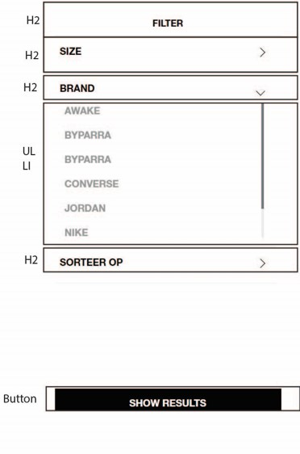

# Procesverslag
Markdown is een simpele manier om HTML te schrijven.  
Markdown cheat cheet: [Hulp bij het schrijven van Markdown](https://github.com/adam-p/markdown-here/wiki/Markdown-Cheatsheet).

Nb. De standaardstructuur en de spartaanse opmaak van de README.md zijn helemaal prima. Het gaat om de inhoud van je procesverslag. Besteedt de tijd voor pracht en praal aan je website.

Nb. Door *open* toe te voegen aan een *details* element kun je deze standaard open zetten. Fijn om dat steeds voor de relevante stuk(ken) te doen.

## Jij

  
uitwerken voor kick-off werkgroep

  ### Auteur:
  Zahra

  #### Je startniveau:
  blauw

  #### Je focus:
  responsive
 

## Je website

  
uitwerken voor kick-off werkgroep

  ### Je opdracht:
  https://www.patta.nl/nl

  #### Screenshot(s) van de eerste pagina (small screen): 
  Blog pagina 
  

  #### Screenshot(s) van de tweede pagina (small screen):
  Koopscherm van een shirt
  
 

## Toegankelijkheidstest 1/2 (week 1)

  
uitwerken na test in 2e werkgroep

  ### Bevindingen
Lijst met je bevindingen die in de test naar voren kwamen:
Bij de iconen krijg je niet gelijk te weten wat ze zijn je moet dan paar keer doorklikken wat erg onhandig is.
Sommige images hebben geen alt. Er worden erg weinig headings gebruikt. De foto's in de blog zijn niet duidelijk dat je erop kan klikken.
Bij de woorden in de navigatie zegt hij het soms spellend wat best onduidelijk is.
Bij de blog omdat de woorden door elkaar zitten leest de screenreader het ook niet helemaal goed op een rijtje wat erg verwarrend is als je niet kan zien.  

## Breakdownschets (week 1)

  
uitwerken na afloop 3e werkgroep

  ### de hele pagina: 
  

  ### dynamisch deel (bijv menu): 
  

  ### wellicht nog een dynamisch deel (bijv filter): 
  

## Voortgang 1 (week 2)

  
uitwerken voor 1e voortgang

  ### Stand van zaken
  hier dit ging goed & dit was lastig (neem ook screenshots op van delen van je website en code)

Het begin voor mijn website ging nog wel goed. Ik begon met de scrollende navigatiebar, dit ging goed omdat we dit tijdens de 
opdracht in de les al hadden geleerd dus wist ik wat ik moest doen.

Het zetten van de foto's ging goed maar er blijft wel een randje aan de buitenkanten steeds wat niet hoort. Het instellen van de 
font ging ook niet echt goed want ik begreep niet waarom het niet op de text kwam.

@font-face {
	font-family: fontNormaal;
	src: url(Helvetica_Neue_Black.woff2);
}

li h2 {
	font-weight: 900;
	font-family: fontNormaal;
	text-transform: uppercase;
}

  ### Agenda voor meeting
  samen met je groepje opstellen

  | student 1      | student 2          | student 3    | student 4        |
  | ---            | ---                | ---          | ---              |
  | dit bespreken  | en dit             | en ik dit    | en dan ik dat    |
  | en dat ook nog | dit als er tijd is | nog een punt | dit wil ik zeker |
  | ...            | ...                | ...          | ...              |

Student 1:
- mag ik class gebruiken als ik woorden OP een foto wil plaatsen, zo niet? Moet ik dan javascript gebruiken?
- Mn header heeft de randen niet gevuld hoe zorg ik ervoor dat de backgroundcolour daar helemaal gevuld is? 
- Hoe neem ik de rechhterhelft van 1 groto foto in plaats van de hele foto?

student 2:
- Moet je iconen als foto inzetten of namaken in css/java (logo ook)?
- Hoe vul ik de hele pagina met de foto er zijn nu witte randen aan de zijkant?
- Me font doet het niet op mijn text?
- Er zit teveel ruimte tussen de text en foto hoe krijg je dat minder?

  ### Verslag van meeting
  hier na afloop snel de uitkomsten van de meeting vastleggen

  - h2, p en img moeten op deze volgorde en dan fixen met css als nodig is
  - foto gebruiken voor icoon is goed 
  - svg gebruiken kan ook
 

## Voortgang 2 (week 3)

  
uitwerken voor 2e voortgang

  ### Stand van zaken
  Het maken van een hamburgermenu is nog best moeilijk en nog niet helemaal gelukt.
  De responsiveness lukt al een beetje met als ik de site groter maak meerdere foto's naast elkaar komen.

  ### Agenda voor meeting
  samen met je groepje opstellen

  | student 1      | student 2          | student 3    | student 4        |
  | ---            | ---                | ---          | ---              |
  | dit bespreken  | en dit             | en ik dit    | en dan ik dat    |
  | en dat ook nog | dit als er tijd is | nog een punt | dit wil ik zeker |
  | ...            | ...                | ...          | ...              |

student 1:
- Wat doet aria label 
- H1 komt na p mag dat
- De backgroundcolour van mn header doet het op de hele pagina, hoe fix ik dit
- qua grootte zijn mn h'tjes en p'tjes juist andersom dus het ziet er raar uit, moet ik dat met css fixen of mag ik het ook in html aanpassen

student 2:
- tekst onder foto, staan nu bij zijkant maar moet er onder
- Ik wil maar 4 colommen als ik site vergroot hoe doe ik dat
- Hoe stop ik de woorden in menu knop
- Als ik site groter maak moet er tekst bij komen in de footer

  ### Verslag van meeting
  hier na afloop snel de uitkomsten van de meeting vastleggen

- als je iets niet wil zien maar wel in screenreader gebruik left tot je niet meer ziet
- voor heading kan je ook aria-label en img gebruiken
- flex-wrap gebruiken om naar andere kant te sturen als te lang
- 

## Toegankelijkheidstest 2/2 (week 4)

  
uitwerken na test in 9e werkgroep

  ### Bevindingen
  Lijst met je bevindingen die in de test naar voren kwamen (geef ook aan wat er verbeterd is):

Alt teksten kunnen wat specifieker zijn dan ik nu heb, zodat gebruikers die het nodig hebben het beter kunnen gebruiken.
De blog pagina word nu op een rijtje gelezen. Je ziet nu ook dat je erop kan klikken. Sommige headings ben ik nog vergeten bij te doen.
Verder leest de screenreader de site best goed. 

## Voortgang 3 (week 4)

  
uitwerken voor 3e voortgang

  ### Stand van zaken
  Iconen willen niet uit elkaar (zijn gestapeld)

  ### Agenda voor meeting
  samen met je groepje opstellen

  | student 1      | student 2          | student 3    | student 4        |
  | ---            | ---                | ---          | ---              |
  | dit bespreken  | en dit             | en ik dit    | en dan ik dat    |
  | en dat ook nog | dit als er tijd is | nog een punt | dit wil ik zeker |
  | ...            | ...                | ...          | ...              |

student 1:
- Hoe zet ik mn logo links en groter zonder mn menu te verpesten. 
- Mn screenreader leest de normale tekst niet. Dus buttons wel maar p niet. 
- Mn slider heeft meerdere fotos die bijna identiek zijn mag ik 1 foto gebruiken voor alles. 
- Mn tweede pagina gaat mis wnr ik het scherm groter maak. De main sections blijven op telefoon formaat

student 2:
- Bij footer section p hoort als site kleiner is niet te zien zijn maar dat gebeurt niet alleen als static weg is maar dan te groot,
- Menu button wil niet boven komen, 
- Header iconen willen niet uit elkaar,
- Hoe hover ik over img dat er dan een andere komt

student 3:
- Ik heb nog: hoe krijg je lijnen tussen de li, hoe krij ik dat de header tevoorschijn komt zodra ik naar boven scrol

  ### Verslag van meeting
- gebruik z-index om dingen over elkaar te laten gaan
- niet alles hoeft lijn eronder als het al duidelijk is
- niet per img postition fixed doen 
- met z-index werken als over hover dan naar boven komt

## Eindgesprek (week 5)

  
uitwerken voor eindgesprek

  ### Je uitkomst - karakteristiek screenshots:
  

  ### Dit ging goed/Heb ik geleerd: 
 Ik heb geleerd hoe ik een site responsive moet maken en hoe ik een hamburgermenu kan maken die animeert.

  
    

  ### Dit was lastig/Is niet gelukt:
  Wat eerst erg moeilijk ging was een dropdown maken met js erbij ik benoemde steeds de verkeerde dingen
  Waar ik erg veel tijd in moest steken is de header die met de pagina mee gaat het lukte telkens niet om ze 
  goed te positioneren en ook als de site groter of kleiner word ging erg moeilijk en ben daar nogsteeds met het resultaat niet heel blij mee.

  
   

## Bronnenlijst

  
continu bijhouden terwijl je werkt

  Nb. Wees specifiek ('css-tricks' als bron is bijv. niet specifiek genoeg). 
  Nb. ChatGpT en andere AI horen er ook bij.
  Nb. Vermeld de bronnen ook in je code.

  1. https://codepen.io/shooft/pen/qBLxdzP?editors=1010
  2. https://codepen.io/shooft/pen/qBLxdym?editors=1100
  3. https://dlo.mijnhva.nl/content/enforced/536487-FDMCI-2000FED121-DMCI-CMD-2324/FED%2023-24%20-%20Blok%201%20-%20Oefening%20grid.pdf
  4. https://codepen.io/shooft/pen/vYvELNv
  5. https://dlo.mijnhva.nl/content/enforced/536487-FDMCI-2000FED121-DMCI-CMD-2324/FED%2023-24%20-%20Blok%201%20-%20Oefening%20flexbox.pdf
  6. https://codepen.io/shooft/pen/ZEVYKLM
  7. https://dlo.mijnhva.nl/content/enforced/536487-FDMCI-2000FED121-DMCI-CMD-2324/FED%2023-24%20-%20Blok%201%20-%20Oefening%20positioneren.pdf
  8. https://codepen.io/shooft/pen/GRPgMGW
  9. https://dlo.mijnhva.nl/content/enforced/536487-FDMCI-2000FED121-DMCI-CMD-2324/FED%2023-24%20-%20Blok%201%20-%20Oefening%20animeren.pdf
  10. https://codepen.io/shooft/live/NWePYRO
  11. https://www.w3schools.com/cssref/pr_class_cursor.php

